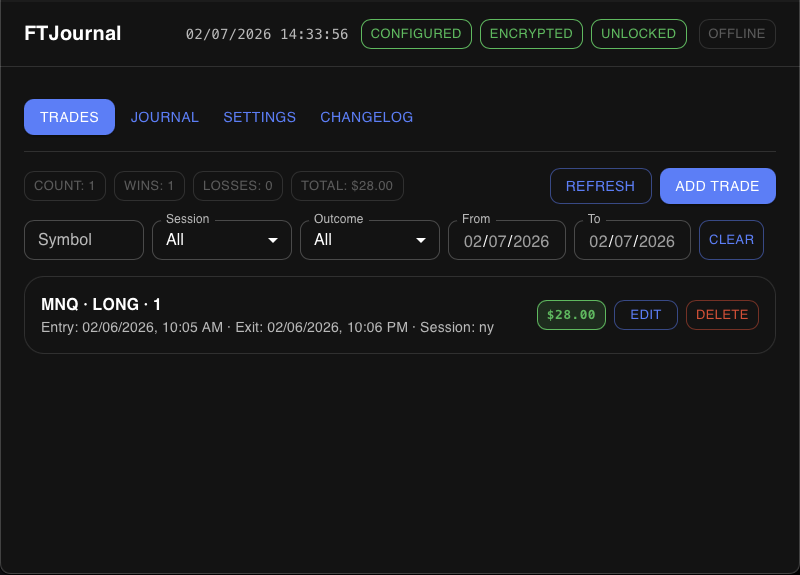
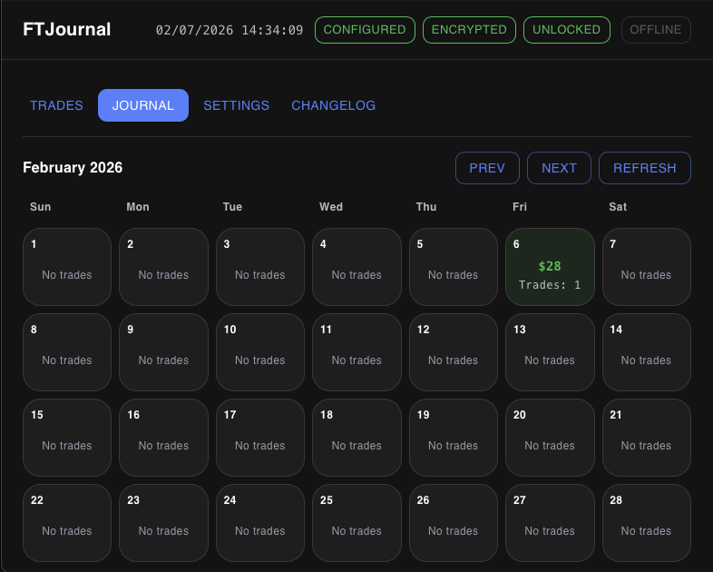
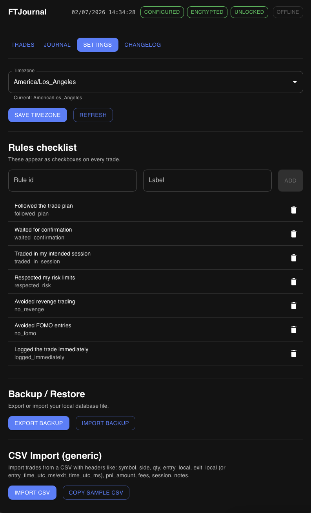

# FTJournal (Futures Trading Journal Desktop)

Local-first trading journal for **futures day traders**.

- **No accounts / no sign-in**
- **Offline-first** (your data stays on your machine)
- Local database (SQLite) with **optional encryption**
- macOS + Windows desktop app (Tauri)

## Status
Early development (v0.1 in progress).

## Features (current)
- **Trades**: Add/edit/delete completed trades
- **Rules checklist**: Custom rules shown on every trade (track discipline)
- **Journal**: Calendar month view with per-day journal entry
- **Daily drill-down**: Click a day to see that day’s trades + notes
- **Filters + quick stats**: Symbol/session/outcome/date filters + win/loss totals
- **Local SQLite** with **optional encryption (SQLCipher)**
- **Backup/restore**: Export/import database file (local-first)
- **CSV import (generic MVP)**: Import trades from a CSV

## Screenshots
_(Coming next)_

If you want to add screenshots:
- Save PNGs into `docs/screenshots/`
- Update this section to embed them, e.g.

```md



```

## Notes on unsigned builds
FTJournal releases are **not code-signed/notarized**.

- **macOS**: you may need to right-click the app → **Open** on first launch (Gatekeeper).
- **Windows**: SmartScreen may warn; click **More info** → **Run anyway**.

## Changelog
See `CHANGELOG.md`.

## Privacy
FTJournal does not require any network connection to operate. Imports and your journal database live on your machine.

See:
- `docs/PRIVACY.md`
- `docs/THREAT_MODEL.md`

## Install / Run (users)
### Download (recommended)
Download the latest prebuilt app from **GitHub Releases**:
https://github.com/AIBotCasey/futures-trading-journal-desktop/releases

### Run from source
Releases may not always be available for every commit. You can also run FTJournal from source.

### macOS
1) Install prerequisites:
- Node.js (>= 20)
- Rust (stable)
- Tauri prerequisites (Xcode Command Line Tools, etc.): https://tauri.app/start/prerequisites/

2) Run:
```bash
git clone https://github.com/AIBotCasey/futures-trading-journal-desktop.git
cd futures-trading-journal-desktop/apps/desktop
npm install
npm run tauri dev
```

### Windows
1) Install prerequisites:
- Node.js (>= 20)
- Rust (stable)
- Tauri prerequisites (WebView2 + Visual Studio Build Tools): https://tauri.app/start/prerequisites/

2) Run (PowerShell):
```powershell
git clone https://github.com/AIBotCasey/futures-trading-journal-desktop.git
cd futures-trading-journal-desktop\apps\desktop
npm install
npm run tauri dev
```

## Build installers
See `docs/BUILDING.md`.

## Development
### Prerequisites
- Node.js (>= 20)
- Rust toolchain (stable)
- Tauri prerequisites: https://tauri.app/start/prerequisites/

### Run the desktop app
```bash
cd apps/desktop
npm install
npm run tauri dev
```

## Contributing
See `CONTRIBUTING.md`.

## License
Apache-2.0. See `LICENSE`.
